# README DOCUMENTATION
## Link to GitHub repository
A link to the GitHub repository can be found below:
https://github.com/MorganRohan/MorganRohan_T1A3

Download instructions and requirements can be found at the end of this document.

This is a terminal app built with the Ruby programming language, and as such will conform to the Ruby style. A link to a style guide for the language can be found below:
https://ruby-style-guide.shopify.dev/ 

# App Documentation
## App Overview
The BookShelf app is designed to be an interactive book review and recommendation platform, so that the user can record their own reviews of books they've read, access the reviews again, create a reading list and get recommendations. Reviews are able to be accessed once completed, as well as being stored in a file that can be easily read and utilised outside of the app. There is also a reading list function, allowing the user to add book titles to a file for reference later on. A quiz can be taken to get a book recommendation, based on the answers to a series of questions. 

## Scope
The scope of the application is in three parts, as follows:

1. The review section, which allows the user to input their own review of a book and have that stored against the title to be accessed again or printed at a later date. The file that the reviews are stored in ccan be accessed externally from the app and is a .txt file, so that it can further be used. 
- User inputs book title
- User can give a star rating out of 5
- User can write a review 
- User has most recent review printed back to the screen for them
- User can access all stored reviews and have them:
 a) printed back on the screen
 b) all deleted

2. The reading list section, which will give the user the option to add titles, along with the author information, to a list. This list can be printed back to the user, and is store in a file that can also be accessed outside of the app, in the same way the reviews .txt file can.
- User inputs book title
- User inputs book author
- User has most recent entry printed back to the screen for them
- User can access all stored entries and have them:
 a) printed back on the screen
 b) all deleted

3. The recommendation section, which will be in the form of a quiz that the user can take to give a recommendation based on their interests. 
- User will be asked a series of multiple choice questions and will give their answer for each one
- These answers will be converted to points, with points being allocated towards each recommendation. The one with the most points will be printed as the recommendation
- User will be prompt to directly add a new entry to the reading list
- User will be taken to the reading list function and have full reading list functionality from there

## Target Audience
The target audience will be book lovers who like to like to review books they've read and get recommendations for new ones to read as well. It can be a way to keep track of what's been read and whether that was enjoyed. It would also appeal to a newer reader who is also after recommendations, or those that don't read much but struggle to keep track of what they have already read or want to read.  

## Example User Interaction
Our example user, Michelle (she/her), will follow the instructions to download and run the app. Once run, Michelle will be greeted with a welcome message and taken to the main menu of the app. From here she can choose to write a review, add to their reading list, take the recommendation quiz or exit the app again. Michelle has opened the app today because she wants to write a review about her most recent read, Lolita. She chooses New Review from the main menu and is prompted to enter a new review. She inputs the title, rating and review information and has the final review printed on the screen for her. She then chooses to view all her stored reviews to see how it compares to other books she's read. Seeing that she has a number of mediocre reviews, she decides to go back to the main menu and take the quiz for a recommendation. After answering each question, she's given a whole list of titles and chooses to add one straight to her reading list, so that later in the day, when she's at the bookshop, she can open the list again and see the title. Satisfied with her experience, she chooses to exit the app. 

# List of Features Included
## Book Reviews
Having chosen New Review from the main menu, the user will be prompted to create a new review. They will have the opportunity to input the book title, select a star rating to give to the book and then add any additional comments or review. This review will be formatted and printed to the screen. The user then has the option to create another review, print all existing reviews, delete all existing reviews or exit to the main menu. It will be implemented using a class called Review, which initializes variables for user input and contains the format for the final review to be printed in. 

For the methods associated with this class, a variety of functions will be used, including an if conditional for inputting the review, a loop for managing the validity of input and open and writing a file. This is outlined in further detail in the Trello board card checklist for the elements in this class.

## Reading List
Having chosen Reading List from the main menu, the user will be prompted to create a new list entry. They will have the opportunity to input the book title, along with the book author. This entry will be formatted and printed to the screen. The user then has the option to create another entry, view all existing entries, delete all existing entries or exit to the main menu. It will be implemented using a class called List and will initialize variables for user input and contains the format for the list entries. 

For the methods associated with this class, a variety of functions will be used, including file read and write, as well as formating methods by type coercion. This is outlined in further detail in the Trello board card checklist for the elements in this class. 

## Recommendation Quiz
Having chosen Recommendation Quiz from the main menu, the user will start the quiz. They will be prompted to answer a series of questions, inputting their preference for each one. Based on their overall score, a recommended genre and list of titles will be printed to the screen. The user then has the option to create a new list entry or exit to main menu. It will be implemented using a class called Quiz and will initialize variables for user input, store the quiz questions along with their recommendations and the method to run the quiz. 

For the methods associated with this class, a variety of functions will be used, including a for loop, with a sub loop using if statements to determine validity, with further conditional statements to print output. This is outlined in further detail in the Trello board card checklist for the elements in this class.

### Main App Page
Whilst not a feature, the main app page brings togther the features for a pleasent and easy to user interface. Within this page, methods are defined primarily for the menu and output functions required. The menus are primarily managed by the TTY-prompt gem, but have while loops defined to determine which methods are invoked based on menu selection. This is outlined in further detail in the Trello board cards for each of the elements incorporated. 

# User Experience

The section below contains screenshots from the final version of the application, included to show what the user might see whilst interacting with the app. 

## Welcome Page
Upon running the app, this is the welcome page that will greet the user and give them some informatino about the app. They will then be prompted to choose from the main menu which feature they want to use. 
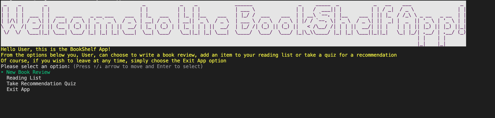

## Review Page
Upon choosing 'New Review' from the main menu, the user will be met with this heading banner, along with the information to input a review. A sample review with valid input has been created for demonstration and then printed to the screen before prompting the user for the next options. 
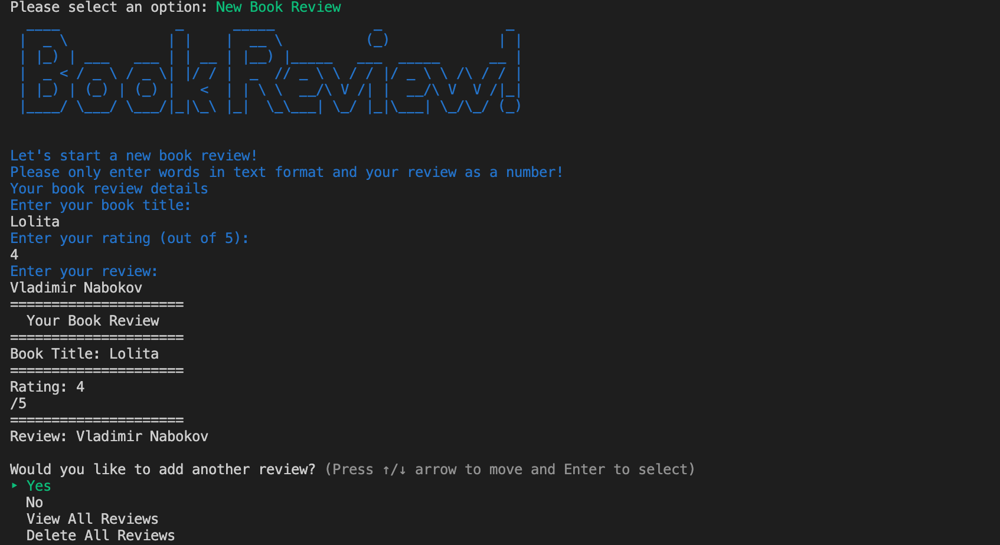

## Reading List Page
Upon choosing 'Reading List' from the main menu, the user will be met with this heading banner, along with the information to input a new list entry. A sample list entry has been created for demonstration and then printed to the screen before prompting the user for the next options.
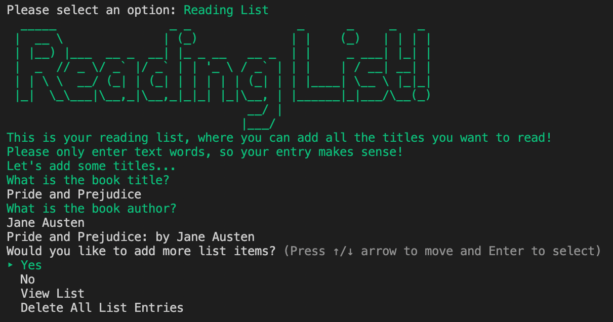

## Recommendation Quiz Page
Upon choosing 'Recommendation Quiz, from the main menu, the user will be met with this timed welcome banner, along with the information to input answers to a quiz. An example quiz has been taken with all 'a' answers, prompting a list of recommendations to be printed to the screen. The user is then prompted with the next options. 
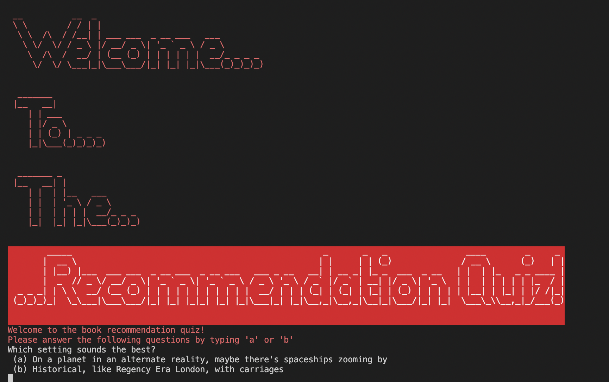
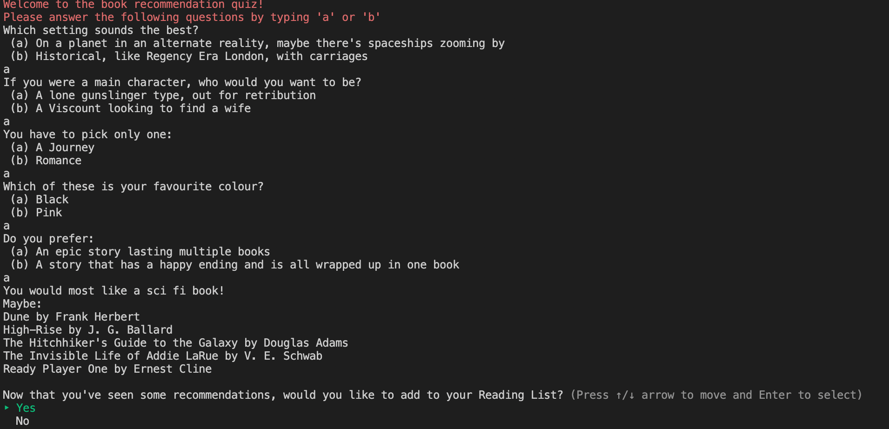

# Implementation Plan
## Control Flow Diagram
Control flow diagram, showing flow of user experience in app, along with the various loops and redirections that need to occur.
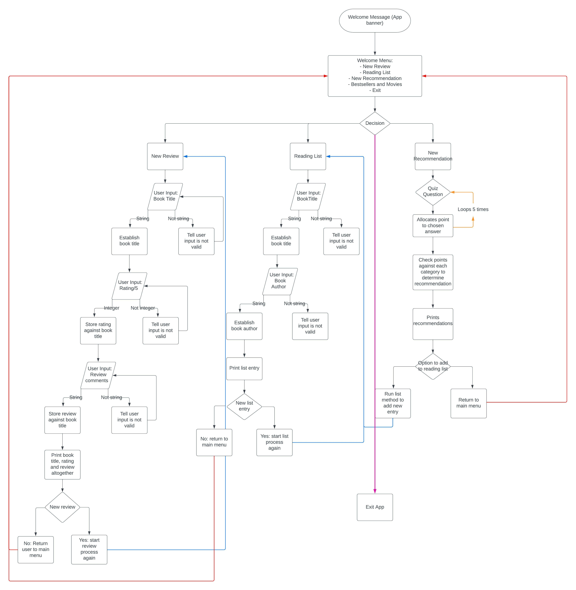
## Overall App
For the implementation of this project, a Trello board was utiilised heavily to plan, keep track of and execute all the required elements. A link to this board can be found below:
https://trello.com/b/JWDhK0j2/terminal-app

Further details about the board, along with specific screenshots will now be provided. 

Upon release of the project and knowing the requirements, an initial Trello board was established with the first iteration of the app. This was established on April 12th and had a slightly different set of features for the app. The image below shows this board, with the initial framework laid out to satisfy the elements for each feature, but without the full implementation details added as yet. The second image shows that by April 15th, further detail was added, including tags for the importance of elements and the due dates for each section. 
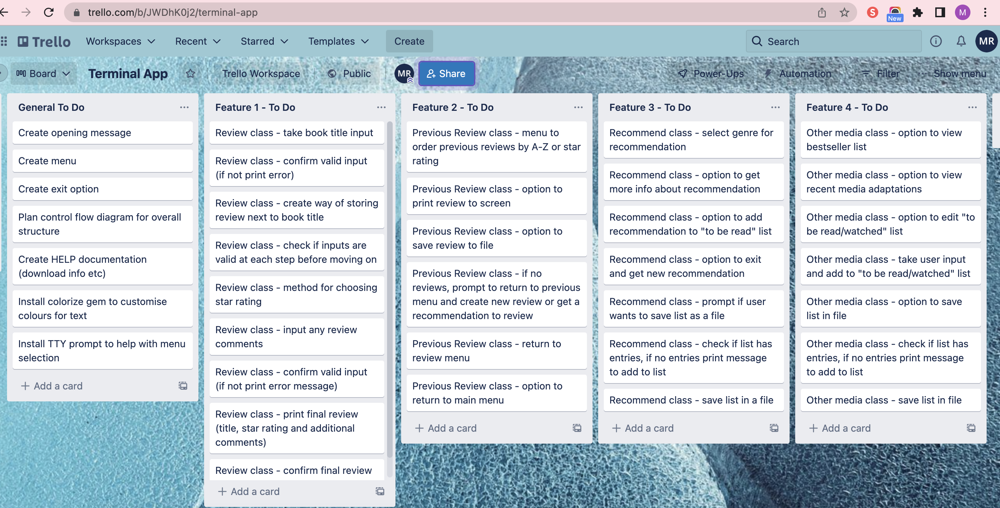
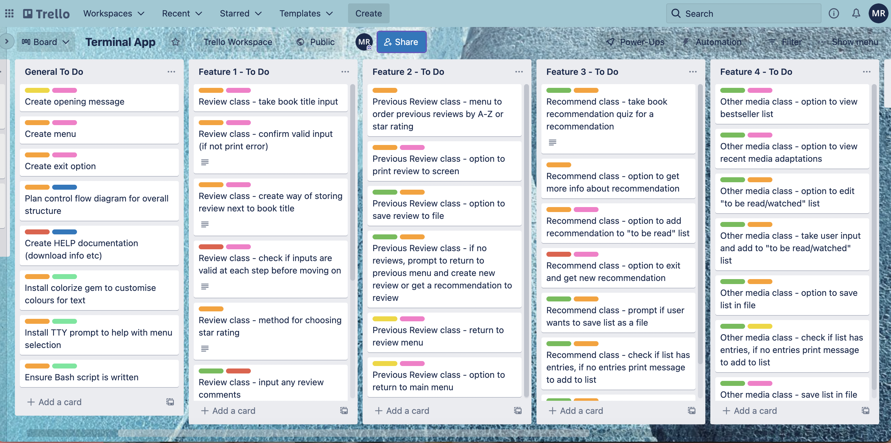
This image from April 17th shows the final version of the app, with the modified features (and corresponding classes). At this point it was decided to pivot to add the reading list functionality as its own feature and push the previous reviews feature into the reviews class. A fourth feature can also be seen, however, this was ultimately eliminated from the plan on April 20th in order due to time pressures. The decision was made to instead focus on the three main features - reviews, reading list and recommendations - and work on providing a high level of functionality for these instead of risking an overall drop in quality for an extra feature.
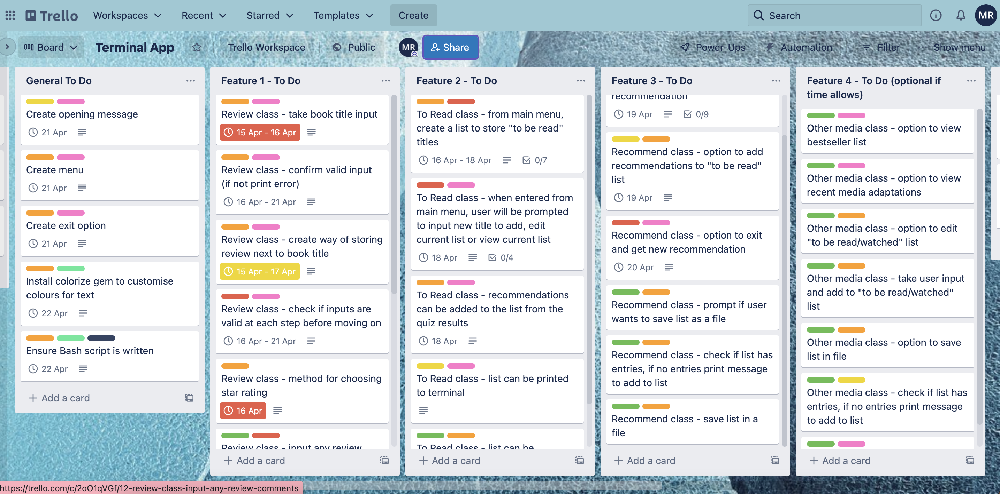

For my own style of organisation, I opted to add the due dates and checklists to the cards for the classes and elements, rather than adding "doing" or "done" columns to move the cards too. This ensured that all details of that feature remained together and that all the columns fit within my screen, so that nothing got lost or forgotten.
The final Trello board, along with all completed elements can be seen below:
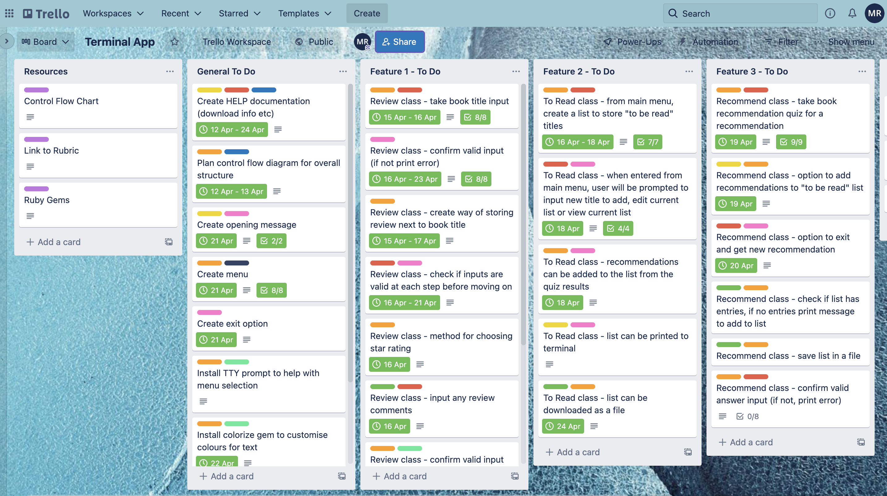

# Help Documentation
## Installation Directions
In order to run this app on your laptop, you will need to have access to a computer with the capability to run a program such as VS Code, which this app was created in and will help give the best user experience. VS Code is available to download for free and requires a 1.6 GHZ or better processor and 1 GB of RAM. Most modern laptops or computers will easily cover this. 
Minimum system requirements and a link to install and set up VS Code are below for Mac, Windows and Linux users.
For Mac: 
- Minimum system requirements are OS X El Capitan (version 10.11+)
- Link to VS Code download instructions for Mac: https://code.visualstudio.com/docs/setup/mac
For Windows: 
- Minimum system requirements are Windows 8.0, 8.1 and 10, 11 (32-bit and 64-bit)
- Link to VS Code download instructions for Windows: https://code.visualstudio.com/docs/setup/windows
For Linux:
- Minimum system requirements are Ubuntu Desktop 16.04, Debian 9 for Linux (Debian) or Red Hat Enterprise Linux 7, CentOs 7 and Fedora 34 for Linux (Red Hat)
- Link to VS Code download instructions for Linux: https://code.visualstudio.com/docs/setup/linux 

Once this is completed and set up following the VS Code documentation, you will need to install Ruby on your computer. A thorough guide on how to install Ruby can be found at this link: https://www.ruby-lang.org/en/downloads/ 
It covers how to install Ruby on a range of operating systems.

For reference, this app was created on a MacBook Pro running macOS Monterey v12.3.1, VS Code v1.66.2 and using Ruby v2.7.5

Following this, a cloned version of the GitHub repository at the beginning of this document will also need to be downloaded. Here is another copy of that link:
https://github.com/MorganRohan/MorganRohan_T1A3 

Another requirement for the app to be run correctly, is the installation of a number of Ruby Gems. This will be done in a single step through the use of in built commands in a bash script file. 

## Running BookShelf App
The BookShelf application runs through the command line and can be executed in a single step using a bash script file. After installing Ruby and cloning the repository, follow these steps:
1. Open your terminal
2. Change directories to the directory where the repository was downloaded:

3. Change directories to the source directory:

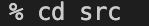

4. Once in the source directory, please run the following command to execute the program:

5. Optional app experience: if you have downloaded and run the app as above, the next time you go to run the app, instead of running it from the bash script file, you can use the command below to run the app with your own name for a more personalised experience:
ruby bookapp.rb Yournamehere
6. Optional app experience: follow instructions as above, but once in the source directory, type 'code .' to open the app in VS Code. Once there, the app can be run in the terminal using the command ./run_app.sh but allows the user to inspect all of the coding files.
7. Optional app experience: since both the reviews and reading list entries are being written to .txt files, you can search for these in file explorer to access and read externally to the app. 

### Thank you for choosing to download BookShelf App!

### References

Code.visualstudio.com. 2022. Requirements for Visual Studio Code. [online] Available at: <https://code.visualstudio.com/docs/supporting/requirements#:~:text=Visual%20Studio%20Code%20is%20a,1.6%20GHz%20or%20faster%20processor> [Accessed 22 April 2022].

Code.visualstudio.com. 2022. Running Visual Studio Code on Windows. [online] Available at: <https://code.visualstudio.com/docs/setup/windows> [Accessed 22 April 2022].

Code.visualstudio.com. 2022. Running Visual Studio Code on Linux. [online] Available at: <https://code.visualstudio.com/docs/setup/linux> [Accessed 22 April 2022].

Code.visualstudio.com. 2022. Running Visual Studio Code on macOS. [online] Available at: <https://code.visualstudio.com/docs/setup/mac> [Accessed 22 April 2022].

Ruby-style-guide.shopify.dev. 2022. Ruby Style Guide. [online] Available at: <https://ruby-style-guide.shopify.dev/> [Accessed 22 April 2022].